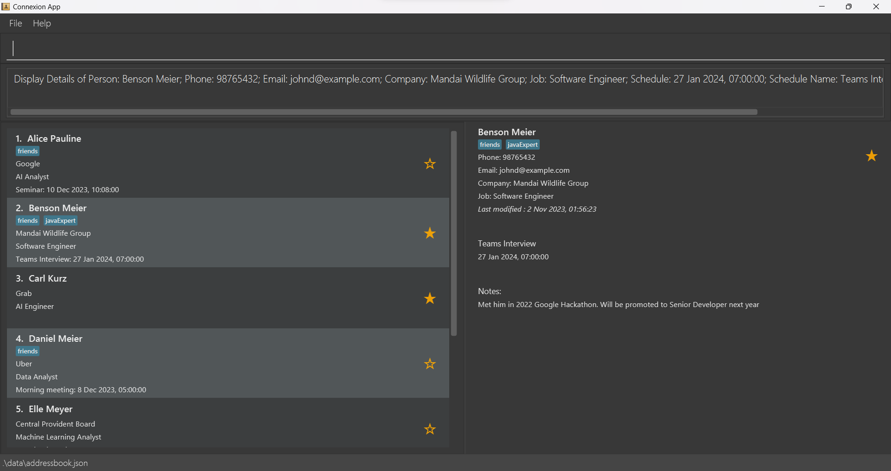

**Connexion** is a desktop application for undergraduate students to manage their networking connections in the Tech industry.
* It is optimized for text UI usage via a Command Line Interface (CLI).
* Users can view their connections on a neat Graphical User Interface (GUI).

If you:
1. are a **fast** typer
2. prefer a **lightweight** user interface instead of fancy graphics
 

**Connexion** will get your connections sorted out in no time.

### Documentation
* **[Connexion Product Website](https://ay2324s1-cs2103-f13-1.github.io/tp/)**

### Acknowledgement
* This project is based on the AddressBook-Level3 project created by the [SE-EDU initiative](https://se-education.org).

