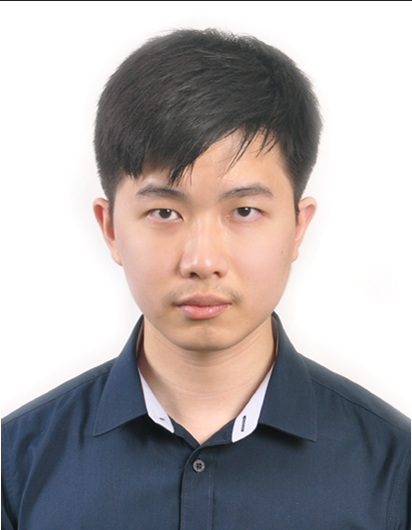

We are a team based in the [School of Computing, National University of Singapore](http://www.comp.nus.edu.sg).

You can reach us at the email `seer[at]comp.nus.edu.sg`

## Project team

### Angel Lee

[[github](https://github.com/angelyxx)]
[[portfolio](team/angelyxx.md)]

* Role: Developer
* Responsibilities: Testing, Code Quality, Git Expert

### Kuan Kwok Yong

[[github](http://github.com/imkwokyong)]
[[portfolio](team/imkwokyong.md)]

* Role: Developer
* Responsibilities : Deliverables & Deadlines, Scheduling & Tracking

### Geoff Ong

[[github](http://github.com/geoffong11)]
[[portfolio](team/geoffong11.md)]

* Role: Developer, Team Lead
* Responsibilities: Documentation

### Xavier Pok

[[github](http://github.com/xavierpok)]
[[portfolio](team/xavierpok.md)]

* Role: Developer
* Responsibilities: Testing, Code Quality, IDE Expert

