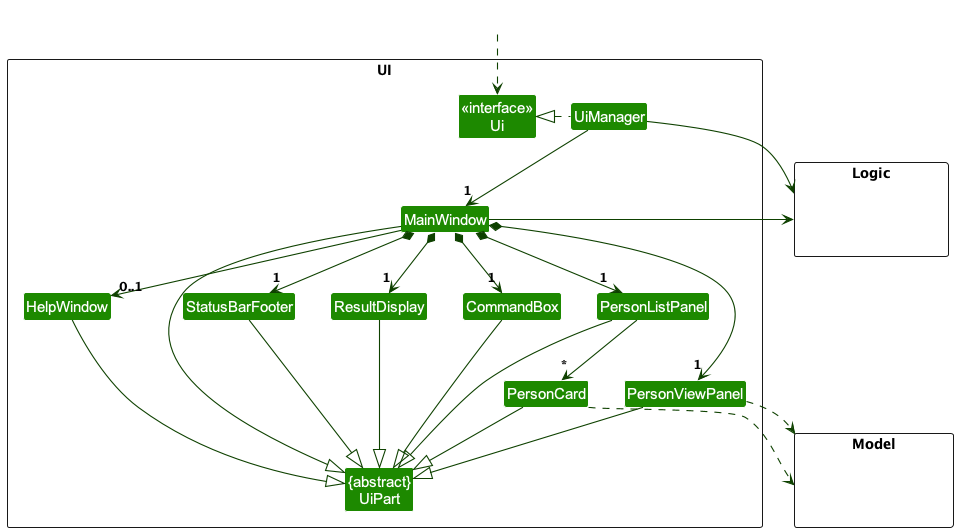
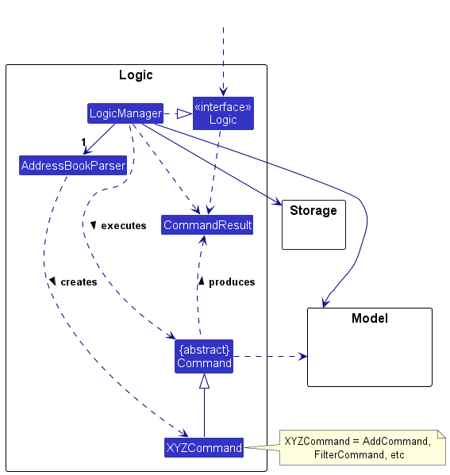
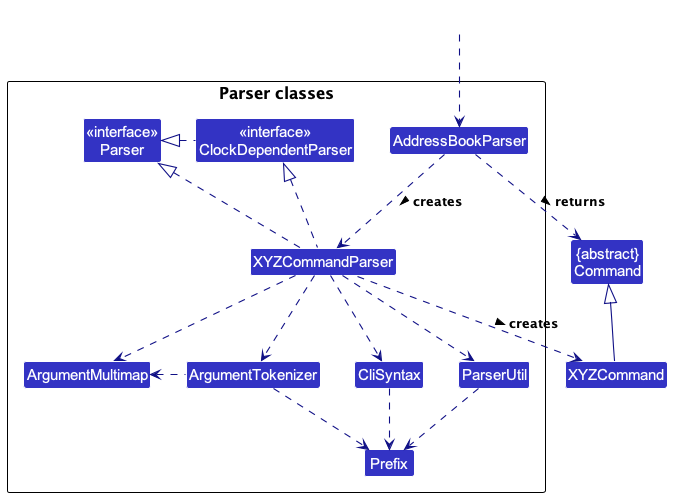
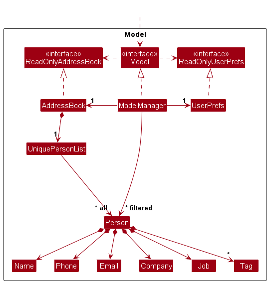
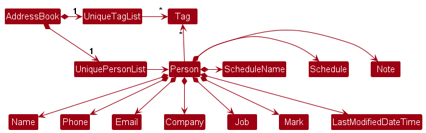
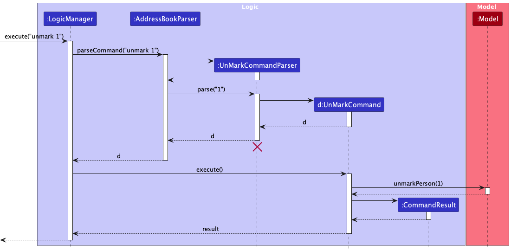

* Table of Contents
{:toc}

--------------------------------------------------------------------------------------------------------------------

## **Acknowledgements**

* {list here sources of all reused/adapted ideas, code, documentation, and third-party libraries -- include links to the original source as well}

--------------------------------------------------------------------------------------------------------------------

## **Setting up, getting started**

Refer to the guide [_Setting up and getting started_](SettingUp.md).

--------------------------------------------------------------------------------------------------------------------

## **Design**

:bulb: **Tip:** The `.puml` files used to create diagrams in this document `docs/diagrams` folder. Refer to the [_PlantUML Tutorial_ at se-edu/guides](https://se-education.org/guides/tutorials/plantUml.html) to learn how to create and edit diagrams.

### Architecture

The ***Architecture Diagram*** given above explains the high-level design of the App.

Given below is a quick overview of main components and how they interact with each other.

**Main components of the architecture**

**`Main`** (consisting of classes [`Main`](https://github.com/se-edu/addressbook-level3/tree/master/src/main/java/seedu/address/Main.java) and [`MainApp`](https://github.com/se-edu/addressbook-level3/tree/master/src/main/java/seedu/address/MainApp.java)) is in charge of the app launch and shut down.
* At app launch, it initializes the other components in the correct sequence, and connects them up with each other.
* At shut down, it shuts down the other components and invokes cleanup methods where necessary.

The bulk of the app's work is done by the following four components:

* [**`UI`**](#ui-component): The UI of the App.
* [**`Logic`**](#logic-component): The command executor.
* [**`Model`**](#model-component): Holds the data of the App in memory.
* [**`Storage`**](#storage-component): Reads data from, and writes data to, the hard disk.

[**`Commons`**](#common-classes) represents a collection of classes used by multiple other components.

**How the architecture components interact with each other**

The *Sequence Diagram* below shows how the components interact with each other for the scenario where the user issues the command `delete 1`.

Each of the four main components (also shown in the diagram above),

* defines its *API* in an `interface` with the same name as the Component.
* implements its functionality using a concrete `{Component Name}Manager` class (which follows the corresponding API `interface` mentioned in the previous point.

For example, the `Logic` component defines its API in the `Logic.java` interface and implements its functionality using the `LogicManager.java` class which follows the `Logic` interface. Other components interact with a given component through its interface rather than the concrete class (reason: to prevent outside component's being coupled to the implementation of a component), as illustrated in the (partial) class diagram below.

The sections below give more details of each component.

### UI component

The **API** of this component is specified in [`Ui.java`](https://github.com/se-edu/addressbook-level3/tree/master/src/main/java/seedu/address/ui/Ui.java)

The UI consists of a `MainWindow` that is made up of parts e.g.`CommandBox`, `ResultDisplay`, `PersonListPanel`, `StatusBarFooter` etc. All these, including the `MainWindow`, inherit from the abstract `UiPart` class which captures the commonalities between classes that represent parts of the visible GUI.

The `UI` component uses the JavaFx UI framework. The layout of these UI parts are defined in matching `.fxml` files that are in the `src/main/resources/view` folder. For example, the layout of the [`MainWindow`](https://github.com/se-edu/addressbook-level3/tree/master/src/main/java/seedu/address/ui/MainWindow.java) is specified in [`MainWindow.fxml`](https://github.com/se-edu/addressbook-level3/tree/master/src/main/resources/view/MainWindow.fxml)

The `UI` component,

* executes user commands using the `Logic` component.
* listens for changes to `Model` data so that the UI can be updated with the modified data.
* keeps a reference to the `Logic` component, because the `UI` relies on the `Logic` to execute commands.
* depends on some classes in the `Model` component, as it displays `Person` object residing in the `Model`.

### Logic component

**API** : [`Logic.java`](https://github.com/se-edu/addressbook-level3/tree/master/src/main/java/seedu/address/logic/Logic.java)

Here's a (partial) class diagram of the `Logic` component:

As another example that is sensitive to a `Clock` object (as per the Java API) for timekeeping, a second sequence diagram for `add {ARGS}`
, where `{ARGS}` is some valid set of arguments, is also below.

**For the sake of brevity, where the `Clock` object is irrelevant, the call to `AddressBookParser#withClock` will be omitted in subsequent diagrams.**

As an example of when the `Clock` object is irrelevant, the sequence diagram below illustrates the interactions within the `Logic` component, taking `execute("delete 1")` API call as an example.

:information_source: **Note:** The lifeline for `DeleteCommandParser` should end at the destroy marker (X) but due to a limitation of PlantUML, the lifeline reaches the end of diagram.

How the `Logic` component works:

1. When `Logic` is called upon to execute a command, it is passed to an `AddressBookParser` object which in turn creates a parser that matches the command (e.g., `DeleteCommandParser`) and uses it to parse the command
1. This results in a `Command` object (more precisely, an object of one of its subclasses e.g., `DeleteCommand`) which is executed by the `LogicManager`.
1. The command can communicate with the `Model` when it is executed (e.g. to delete a person).
1. The result of the command execution is encapsulated as a `CommandResult` object which is returned back from `Logic`.

Here are the other classes in `Logic` (omitted from the class diagram above) that are used for parsing a user command:

How the parsing works:
* When called upon to parse a user command, the `AddressBookParser` class creates an `XYZCommandParser` (`XYZ` is a placeholder for the specific command name e.g., `AddCommandParser`) which uses the other classes shown above to parse the user command and create a `XYZCommand` object (e.g., `AddCommand`) which the `AddressBookParser` returns back as a `Command` object.
* All `XYZCommandParser` classes (e.g., `AddCommandParser`, `DeleteCommandParser`, ...) inherit from the `Parser` interface so that they can be treated similarly where possible e.g, during testing.
* All `XYZCommandParser` classes that further need to be aware of the current time (i.e. `AddCommandParser` & `EditCommandParser`) further inherit from the `ClockDependentParser` interface.
* Any command that needs to be aware of the current time takes the current time during parsing. (I.e. `add` & `edit`)

### Model component
**API** : [`Model.java`](https://github.com/se-edu/addressbook-level3/tree/master/src/main/java/seedu/address/model/Model.java)

The `Model` component,

* stores the address book data i.e., all `Person` objects (which are contained in a `UniquePersonList` object).
* stores the currently 'selected' `Person` objects (e.g., results of a search query) as a separate _filtered_ list which is exposed to outsiders as an unmodifiable `ObservableList<Person>` that can be 'observed' e.g. the UI can be bound to this list so that the UI automatically updates when the data in the list change.
* stores a `UserPref` object that represents the user’s preferences. This is exposed to the outside as a `ReadOnlyUserPref` objects.
* does not depend on any of the other three components (as the `Model` represents data entities of the domain, they should make sense on their own without depending on other components)

:information_source: **Note:** An alternative (arguably, a more OOP) model is given below. It has a `Tag` list in the `AddressBook`, which `Person` references. This allows `AddressBook` to only require one `Tag` object per unique tag, instead of each `Person` needing their own `Tag` objects. 

### Storage component

**API** : [`Storage.java`](https://github.com/se-edu/addressbook-level3/tree/master/src/main/java/seedu/address/storage/Storage.java)

The `Storage` component,
* can save both address book data and user preference data in JSON format, and read them back into corresponding objects.
* inherits from both `AddressBookStorage` and `UserPrefStorage`, which means it can be treated as either one (if only the functionality of only one is needed).
* depends on some classes in the `Model` component (because the `Storage` component's job is to save/retrieve objects that belong to the `Model`)

### Common classes

Classes used by multiple components are in the `connexion.commons` package.

--------------------------------------------------------------------------------------------------------------------

## **Implementation**

This section describes some noteworthy details on how certain features are implemented.

### Filter feature (implemented by Kwok Yong)
The user can filter contacts based on a specified field and keywords.

Each field has its own predicate, `{Field}ContainsKeywordsPredicate` or `{Is/Not}MarkedPredicate`. 
For example, `JobContainsKeywordsPredicate` represents the predicate for Job. 
Through `FilterCommandParser`, a field prefix is detected to recognize the field to filter for. Then, depending
on the field, the parser will determine whether to parse keywords as a list. Then, the parser will construct the corresponding predicate, 
which in turn is used to construct a `FilterCommand`.

Through `FilterCommand#execute()`, the predicate is then passed as an argument to `Model#updateFilteredPersonList()`, causing the UI to only show contacts who satisfy the predicate.

The sequence diagram below shows the interaction between Logic and Model components after the API call `execute("filter c/Google")`

The reason behind implementing the feature this way is that this feature is partly inspired
by the prior implementation of the find feature in AB3. This is just an enhancement of the feature, in which the target
user is more likely to find filtering contacts via a specified field, especially company and job, useful.

An ongoing discussion is to merge the separate predicates into one but it takes low precedence.

### LastModified (implemented by Xavier)
Each `Person` has a last modified detailing when it was last modified.

The information below has also been briefly integrated into the detailing of [parsing & logic](#logic-component), but with less-relevant details excluded above.

The `Model` has a `Clock` object (as described in the [Java time API](https://docs.oracle.com/javase/8/docs/api/java/time/Clock.html)), which is set to
the current system time on instantiation. The methods `setClock` and `getClock` are exposed to modify the clock used, for testing or for extension.

The `Logic` object reads the `Model`'s clock to reference what clock operations should use, and instantiates a version of `AddressBookParser` that uses that clock via chained method `withClock`.
The new `AddressBookParser` then further passes the clock via method chaining to any `ClockDependentParser`s, or ignores the clock for commands that do not need to care about the clock.

Currently, the only `ClockDependentParser`s are `AddCommandParser` and `EditCommandParser`.

Finally, the relevant parsers read the clock via `LocalDateTime.now(clock)` to extract the correct `LocalDateTime` object as needed.

This `LocalDateTime` is passed into the `LastModifiedDateTime` constructor for further use as a field in relevant objects.
Furthermore, `LastModifiedDateTime` truncates the `LocalDateTime` to precision of seconds.

Of note, this means that :
* `LastModifiedDateTime` will have its notion of "current" time set to some time during parsing
* It is possible to inject `Clock` objects for testing/extension into the following objects : `Logic`, `Model`, all `ClockDependentParsers` (including `AddressBookParser`)
* `LastModifiedDateTime`s that vary by milliseconds will evaluate to be the same object

### Schedule feature (implemented by Geoff)
The user can schedule meetings with contacts.

Through `ScheduleCommandParser`, the index of the person in the list and the field prefixes `i/` and `a/` (if there is) are read. Keywords are then parsed and read into a `ScheduleDescripter`
object, where it is used construct a `ScheduleCommand` object.

Through `ScheduleCommand#execute()`, the `scheduleDescriptor` is then used to create a `Person` object with the added or edited schedule and schedule name.
Through `model#setPerson()`, the `Person` object created then replaces the original `Person` object in the list.

The sequence diagram below shows the interaction between Logic and Model components after the API call `execute("schedule 1 i/2023-12-27-07-00 a/Seminar")`

The reason behind implementing this feature this way is partly inspired by the prior implementation of edit feature in AB3.
By using ScheduleDescriptor object, we are able to keep the same level of abstraction.

An alternative is to create a ClearSchedule feature that clears the schedule and scheduleName, as the schedule feature can only
write and override, but not remove.

### Mark Feature (implemented by Angel)
The user can mark contacts of interest through the Mark Command respectively.

The `Mark` attribute has been added to the `Person` Model, and the boolean value of `markStatus` in the `Mark` Class is set to true via the method `mark()`.

When the `MarkCommand` is executed, `markPerson()` is called to the model object with the person chosen by index from the displayed person list.

When a new `person` is created via the `AddCommand`, the markStatus is set to false by default.

If a contact has been marked, the UI will display "★" as the string representation for the `Mark` attribute, otherwise, it represents the attribute as "☆".

The following sequence diagram shows how the mark operation works:

### Unmark Feature (implemented by Angel)
The user can un-mark contacts of interest through the UnMark Command.

The `Mark` attribute has been added to the `Person` Model, and the boolean value of `markStatus` in the `Mark` Class is set to false via the method `unmark()`.

When a new `person` is created via the `AddCommand`, the markStatus is set to false by default.

If a contact has been un-marked, the UI will display "☆" as the string representation for the `Mark` attribute.

The following sequence diagram shows how the un-mark operation works:

### \[Proposed\] Undo/redo feature

#### Proposed Implementation

The proposed undo/redo mechanism is facilitated by `VersionedAddressBook`. It extends `AddressBook` with an undo/redo history, stored internally as an `addressBookStateList` and `currentStatePointer`. Additionally, it implements the following operations:

* `VersionedAddressBook#commit()` — Saves the current address book state in its history.
* `VersionedAddressBook#undo()` — Restores the previous address book state from its history.
* `VersionedAddressBook#redo()` — Restores a previously undone address book state from its history.

These operations are exposed in the `Model` interface as `Model#commitAddressBook()`, `Model#undoAddressBook()` and `Model#redoAddressBook()` respectively.

Given below is an example usage scenario and how the undo/redo mechanism behaves at each step.

Step 1. The user launches the application for the first time. The `VersionedAddressBook` will be initialized with the initial address book state, and the `currentStatePointer` pointing to that single address book state.

Step 2. The user executes `delete 5` command to delete the 5th person in the address book. The `delete` command calls `Model#commitAddressBook()`, causing the modified state of the address book after the `delete 5` command executes to be saved in the `addressBookStateList`, and the `currentStatePointer` is shifted to the newly inserted address book state.

Step 3. The user executes `add n/David …​` to add a new person. The `add` command also calls `Model#commitAddressBook()`, causing another modified address book state to be saved into the `addressBookStateList`.

:information_source: **Note:** If a command fails its execution, it will not call `Model#commitAddressBook()`, so the address book state will not be saved into the `addressBookStateList`.

Step 4. The user now decides that adding the person was a mistake, and decides to undo that action by executing the `undo` command. The `undo` command will call `Model#undoAddressBook()`, which will shift the `currentStatePointer` once to the left, pointing it to the previous address book state, and restores the address book to that state.

:information_source: **Note:** If the `currentStatePointer` is at index 0, pointing to the initial AddressBook state, then there are no previous AddressBook states to restore. The `undo` command uses `Model#canUndoAddressBook()` to check if this is the case. If so, it will return an error to the user rather
than attempting to perform the undo.

The following sequence diagram shows how the undo operation works:

:information_source: **Note:** The lifeline for `UndoCommand` should end at the destroy marker (X) but due to a limitation of PlantUML, the lifeline reaches the end of diagram.

The `redo` command does the opposite — it calls `Model#redoAddressBook()`, which shifts the `currentStatePointer` once to the right, pointing to the previously undone state, and restores the address book to that state.

:information_source: **Note:** If the `currentStatePointer` is at index `addressBookStateList.size() - 1`, pointing to the latest address book state, then there are no undone AddressBook states to restore. The `redo` command uses `Model#canRedoAddressBook()` to check if this is the case. If so, it will return an error to the user rather than attempting to perform the redo.

Step 5. The user then decides to execute the command `list`. Commands that do not modify the address book, such as `list`, will usually not call `Model#commitAddressBook()`, `Model#undoAddressBook()` or `Model#redoAddressBook()`. Thus, the `addressBookStateList` remains unchanged.

Step 6. The user executes `clear`, which calls `Model#commitAddressBook()`. Since the `currentStatePointer` is not pointing at the end of the `addressBookStateList`, all address book states after the `currentStatePointer` will be purged. Reason: It no longer makes sense to redo the `add n/David …​` command. This is the behavior that most modern desktop applications follow.

The following activity diagram summarizes what happens when a user executes a new command:

#### Design considerations:

**Aspect: How undo & redo executes:**

* **Alternative 1 (current choice):** Saves the entire address book.
  * Pros: Easy to implement.
  * Cons: May have performance issues in terms of memory usage.

* **Alternative 2:** Individual command knows how to undo/redo by
  itself.
  * Pros: Will use less memory (e.g. for `delete`, just save the person being deleted).
  * Cons: We must ensure that the implementation of each individual command are correct.

_{more aspects and alternatives to be added}_

### \[Proposed\] Data archiving

_{Explain here how the data archiving feature will be implemented}_

--------------------------------------------------------------------------------------------------------------------

## **Documentation, logging, testing, configuration, dev-ops**

* [Documentation guide](Documentation.md)
* [Testing guide](Testing.md)
* [Logging guide](Logging.md)
* [Configuration guide](Configuration.md)
* [DevOps guide](DevOps.md)

--------------------------------------------------------------------------------------------------------------------

## **Appendix: Requirements**

### Product scope

**Target user profile**:

* has a need to manage a significant number of contacts
* prefer desktop apps over other types
* can type fast
* prefers typing to mouse interactions
* is reasonably comfortable using CLI apps
* undergraduate student interested in managing networking connections in Tech

**Value proposition**: Lightweight, fast interface for experienced users that want to manage their networking connections in the Tech industry quickly.

### User stories

Priorities: High (must have) - `* * *`, Medium (nice to have) - `* *`, Low (unlikely to have) - `*`

| Priority | As a(n) …​      | I want to …​                                            | So that I can…​                                            |
|----------|-----------------|---------------------------------------------------------|------------------------------------------------------------|
| `* * *`  | user            | get text feedback for each line                         | know when the command is received                          |
| `* * *`  | user            | get error feedback on a wrong command                   | know what went wrong                                       |
| `* * *`  | user            | delete a contact                                        | remove entries that I no longer need                       |
| `* * *`  | user            | enter a new contact & their info                        |                                                            |
| `* * *`  | user            | tag contacts                                            | organise contacts better                                   |
| `* * *`  | user            | view contacts                                           |                                                            |
| `* *`    | user            | be able to setup the app quickly                        |                                                            |
| `* *`    | impatient user  | have desired information viewable right on my screen    | avoid having to search for what I'm looking for            |
| `* *`    | user            | mark companies/contacts I've applied to                 | avoid applying to the same company/contact twice           |
| `* *`    | impatient user  | filter/search for contacts                              | narrow down to just contacts I want to look at immediately |
| `* *`    | impatient user  | easily view the user guide                              | reference how to use the app                               |
| `*`      | user            | view the date/time of when a contact was added/modified | know when I added/edited the contact to the list           |
| `*`      | TBA             | TBA                                                     | TBA                                                        |

*{More to be added}*

### Use cases

(For all use cases below, the **System** is the `Connexion` and the **Actor** is the `user`, unless specified otherwise)

**Use case: UC01 - List persons**

**MSS**

1.  User requests to list persons
2.  Connexion shows a list of persons

    Use case ends.

**Use case: UC02 - Delete a person**

**MSS**

1.  User lists the person (UC01)
2.  User requests to delete a specific person
3.  Connexion deletes the person

    Use case ends.

**Extensions**

* 1a. The list is empty.

  Use case ends.

* 2a. The given index is invalid.

    * 2a1. Connexion shows an error message.

      Use case resumes at step 1.

**Use case: UC03 - Add a person**

**MSS**

1.  User lists the person (UC01)
2.  User requests to add a person
3.  Connexion adds the person

    Use case ends.

**Extensions**

* 2a. Connexion detects an error in the entered details

    * 2a1. Connexion shows an error message.

      Use case resumes at step 1.

**Use case: UC04 - Filter for person via a specified field**

**MSS**

1.  User enters field name and keywords
2.  Connexion shows all persons whose field containing the keywords

    Use case ends.

**Use case: UC05 - Update a person**

**MSS**

1.  User lists the person (UC01)
2.  User requests to update a person
3.  Connexion updates person's information

    Use case ends.

**Extensions**

* 1a. The list is empty.

  Use case ends.

* 2a.  The given index is invalid.

    * 2a1.  Connexion shows an error message.

      Use case resumes at step 1.

* 2b. Connexion detects an error in the entered details

    * 2b1. Connexion shows an error message.

      Use case resumes at step 1.

**Use case: UC06 - Mark a person**

**MSS**

1.  User lists the person (UC01)
2.  User requests to mark a person
3.  Connexion marks the person

    Use case ends.

**Extensions**

* 1a. The list is empty.

  Use case ends.

* 2a. The given index is invalid.

    * 2a1. Connexion shows an error message.

      Use case resumes at step 1.

* 2b. The person is already marked.
    * 2b1. Connexion tells the user the person is already marked.

      Use case ends.

### Non-Functional Requirements

1. Should work on any _mainstream OS_ as long as it has Java `11` or above installed.
2. Setup should be possible without configuration (should just be running binaries)
3. Should respond to all inputs within approx. 2 seconds maximum
4. Final size of application should be under 50MB
5. Should retain all core functionality without access to internet
6. Should NOT crash under recoverable circumstances, excepting irrecoverable errors like a `OutOfMemoryError`, application being killed, etc.
7. Should be similar to other shell-like / terminal-like CLI for familiarity for tech field users

*{More to be added}*

### Glossary

* **Mainstream OS**: Windows, Linux, Unix, OS-X
* **Private contact detail**:  A contact detail that is not meant to be shared with others
* **Tag**: A fixed label that is meant for easier searching and organisation
*  **Index**: A number that references the position of person in the list

--------------------------------------------------------------------------------------------------------------------

## **Appendix: Instructions for manual testing**

Given below are instructions to test the app manually.

:information_source: **Note:** These instructions only provide a starting point for testers to work on;
testers are expected to do more *exploratory* testing.

### Launch and shutdown

1. Initial launch

   1. Download the jar file and copy into an empty folder

   1. Double-click the jar file Expected: Shows the GUI with a set of sample contacts. The window size may not be optimum.

1. Saving window preferences

   1. Resize the window to an optimum size. Move the window to a different location. Close the window.

   1. Re-launch the app by double-clicking the jar file. 
       Expected: The most recent window size and location is retained.

1. _{ more test cases …​ }_

### Deleting a person

1. Deleting a person while all persons are being shown

   1. Prerequisites: List all persons using the `list` command. Multiple persons in the list.

   1. Test case: `delete 1` 
      Expected: First contact is deleted from the list. Details of the deleted contact shown in the status message. Timestamp in the status bar is updated.

   1. Test case: `delete 0` 
      Expected: No person is deleted. Error details shown in the status message. Status bar remains the same.

   1. Other incorrect delete commands to try: `delete`, `delete x`, `...` (where x is larger than the list size) 
      Expected: Similar to previous.

1. _{ more test cases …​ }_

### Saving data

1. Dealing with missing/corrupted data files

   1. _{explain how to simulate a missing/corrupted file, and the expected behavior}_

1. _{ more test cases …​ }_
