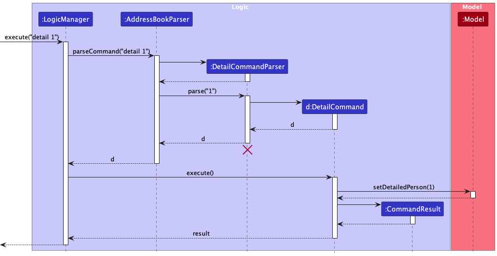

* Table of Contents
{:toc}

--------------------------------------------------------------------------------------------------------------------

## **Acknowledgements**

* {list here sources of all reused/adapted ideas, code, documentation, and third-party libraries -- include links to the original source as well}

--------------------------------------------------------------------------------------------------------------------

## **Setting up, getting started**

Refer to the guide [_Setting up and getting started_](SettingUp.md).

--------------------------------------------------------------------------------------------------------------------

## **Design**

:bulb: **Tip:** The `.puml` files used to create diagrams in this document `docs/diagrams` folder. Refer to the [_PlantUML Tutorial_ at se-edu/guides](https://se-education.org/guides/tutorials/plantUml.html) to learn how to create and edit diagrams.

### Architecture

The ***Architecture Diagram*** given above explains the high-level design of the App.

Given below is a quick overview of main components and how they interact with each other.

**Main components of the architecture**

**`Main`** (consisting of classes [`Main`](https://github.com/se-edu/addressbook-level3/tree/master/src/main/java/seedu/address/Main.java) and [`MainApp`](https://github.com/se-edu/addressbook-level3/tree/master/src/main/java/seedu/address/MainApp.java)) is in charge of the app launch and shut down.
* At app launch, it initializes the other components in the correct sequence, and connects them up with each other.
* At shut down, it shuts down the other components and invokes cleanup methods where necessary.

The bulk of the app's work is done by the following four components:

* [**`UI`**](#ui-component): The UI of the App.
* [**`Logic`**](#logic-component): The command executor.
* [**`Model`**](#model-component): Holds the data of the App in memory.
* [**`Storage`**](#storage-component): Reads data from, and writes data to, the hard disk.

[**`Commons`**](#common-classes) represents a collection of classes used by multiple other components.

**How the architecture components interact with each other**

The *Sequence Diagram* below shows how the components interact with each other for the scenario where the user issues the command `delete 1`.

Each of the four main components (also shown in the diagram above),

* defines its *API* in an `interface` with the same name as the Component.
* implements its functionality using a concrete `{Component Name}Manager` class (which follows the corresponding API `interface` mentioned in the previous point).

For example, the `Logic` component defines its API in the `Logic.java` interface and implements its functionality using the `LogicManager.java` class which follows the `Logic` interface. Other components interact with a given component through its interface rather than the concrete class (reason: to prevent outside component's being coupled to the implementation of a component), as illustrated in the (partial) class diagram below.

The sections below give more details of each component.

### UI component

The **API** of this component is specified in [`Ui.java`](https://github.com/se-edu/addressbook-level3/tree/master/src/main/java/seedu/address/ui/Ui.java)

The UI consists of a `MainWindow` that is made up of parts e.g.`CommandBox`, `ResultDisplay`, `PersonListPanel`, `StatusBarFooter` etc. All these, including the `MainWindow`, inherit from the abstract `UiPart` class which captures the commonalities between classes that represent parts of the visible GUI.

The `UI` component uses the JavaFx UI framework. The layout of these UI parts are defined in matching `.fxml` files that are in the `src/main/resources/view` folder. For example, the layout of the [`MainWindow`](https://github.com/se-edu/addressbook-level3/tree/master/src/main/java/seedu/address/ui/MainWindow.java) is specified in [`MainWindow.fxml`](https://github.com/se-edu/addressbook-level3/tree/master/src/main/resources/view/MainWindow.fxml)

The `UI` component,

* executes user commands using the `Logic` component.
* listens for changes to `Model` data so that the UI can be updated with the modified data.
* keeps a reference to the `Logic` component, because the `UI` relies on the `Logic` to execute commands.
* depends on some classes in the `Model` component, as it displays `Person` object residing in the `Model`.

### Logic component

**API** : [`Logic.java`](https://github.com/se-edu/addressbook-level3/tree/master/src/main/java/seedu/address/logic/Logic.java)

Here's a (partial) class diagram of the `Logic` component:

:information_source: **Note:** The lifeline for `DeleteCommandParser` should end at the destroy marker (X) but due to a limitation of PlantUML, the lifeline reaches the end of diagram.

How the `Logic` component works:

1. When `Logic` is called upon to execute a command, it is passed to an `AddressBookParser` object which in turn creates a parser that matches the command (e.g., `DeleteCommandParser`) and uses it to parse the command
1. This results in a `Command` object (more precisely, an object of one of its subclasses e.g., `DeleteCommand`) which is executed by the `LogicManager`.
1. The command can communicate with the `Model` when it is executed (e.g. to delete a person).
1. The result of the command execution is encapsulated as a `CommandResult` object which is returned back from `Logic`.

Here are the other classes in `Logic` (omitted from the class diagram above) that are used for parsing a user command:

How the parsing works:
* When called upon to parse a user command, the `AddressBookParser` class creates an `XYZCommandParser` (`XYZ` is a placeholder for the specific command name e.g., `AddCommandParser`) which uses the other classes shown above to parse the user command and create a `XYZCommand` object (e.g., `AddCommand`) which the `AddressBookParser` returns back as a `Command` object.
* All `XYZCommandParser` classes (e.g., `AddCommandParser`, `DeleteCommandParser`, ...) inherit from the `Parser` interface so that they can be treated similarly where possible e.g, during testing.
* All `XYZCommandParser` classes that further need to be aware of the current time (i.e. `AddCommandParser` & `EditCommandParser`) further inherit from the `ClockDependentParser` interface.
* Any command that needs to be aware of the current time takes the current time during parsing. (I.e. `add` & `edit`)

### Model component
**API** : [`Model.java`](https://github.com/se-edu/addressbook-level3/tree/master/src/main/java/seedu/address/model/Model.java)

The `Model` component,

* stores the address book data i.e., all `Person` objects (which are contained in a `UniquePersonList` object).
* stores the currently 'selected' `Person` objects (e.g., results of a search query) as a separate _filtered_ list which is exposed to outsiders as an unmodifiable `ObservableList<Person>` that can be 'observed' e.g. the UI can be bound to this list so that the UI automatically updates when the data in the list change.
* stores a `UserPref` object that represents the user’s preferences. This is exposed to the outside as a `ReadOnlyUserPref` objects.
* does not depend on any of the other three components (as the `Model` represents data entities of the domain, they should make sense on their own without depending on other components)

:information_source: **Note:** An alternative (arguably, a more OOP) model is given below. It has a `Tag` list in the `AddressBook`, which `Person` references. This allows `AddressBook` to only require one `Tag` object per unique tag, instead of each `Person` needing their own `Tag` objects. 

### Storage component

**API** : [`Storage.java`](https://github.com/se-edu/addressbook-level3/tree/master/src/main/java/seedu/address/storage/Storage.java)

The `Storage` component,
* can save both address book data and user preference data in JSON format, and read them back into corresponding objects.
* inherits from both `AddressBookStorage` and `UserPrefStorage`, which means it can be treated as either one (if only the functionality of only one is needed).
* depends on some classes in the `Model` component (because the `Storage` component's job is to save/retrieve objects that belong to the `Model`)

### Common classes

Classes used by multiple components are in the `connexion.commons` package.

--------------------------------------------------------------------------------------------------------------------

## **Implementation**

This section describes some noteworthy details on how certain features are implemented.

### Filter feature (implemented by Kwok Yong)
The user can filter contacts based on a specified field and keywords.

Each field has its own predicate, `{Field}ContainsKeywordsPredicate` or `{Is/Not}MarkedPredicate`. 
For example, `JobContainsKeywordsPredicate` represents the predicate for Job. 
Through `FilterCommandParser`, a field prefix is detected to recognize the field to filter for. Then, depending
on the field, the parser will determine whether to parse keywords as a list. Then, the parser will construct the corresponding predicate, 
which in turn is used to construct a `FilterCommand`.

Through `FilterCommand#execute()`, the predicate is then passed as an argument to `Model#updateFilteredPersonList()`, causing the UI to only show contacts who satisfy the predicate.

The sequence diagram below shows the interaction between Logic and Model components after the API call `execute("filter c/Google")`

The reason behind implementing the feature this way is that this feature is partly inspired
by the prior implementation of the find feature in AB3. This is just an enhancement of the feature, in which the target
user is more likely to find filtering contacts via a specified field, especially company and job, useful.

### LastModified (implemented by Xavier)
Each `Person` has a last modified detailing when it was last modified.

This necessitates the implementation of an internal `Clock` object in the `Model` and `Logic` classes.

The `Model` has a `Clock` object (as described in the [Java time API](https://docs.oracle.com/javase/8/docs/api/java/time/Clock.html)), which is set to
the current system time on instantiation. The methods `setClock` and `getClock` are exposed to modify the clock used, for testing or for extension.

The `Logic` object reads the `Model`'s clock to reference what clock operations should use, and instantiates a version of `AddressBookParser` that uses that clock via chained method `withClock`.
The new `AddressBookParser` then further passes the clock via method chaining to any `ClockDependentParser`s, or ignores the clock for commands that do not need to care about the clock.

Currently, the only `ClockDependentParser`s are `AddCommandParser`,`EditCommandParser`,`ScheduleParser` and `NoteParser`.

Finally, the relevant parsers read the clock via `LocalDateTime.now(clock)` to extract the correct `LocalDateTime` object as needed.

The above is summarised in the activity diagram below :

This `LocalDateTime` is passed into the `LastModifiedDateTime` constructor for further use as a field in relevant objects.
Furthermore, `LastModifiedDateTime` truncates the `LocalDateTime` to precision of seconds.

Of note, this means that :
* `LastModifiedDateTime` will have its notion of "current" time set to some time during parsing
* It is possible to inject `Clock` objects for testing/extension into the following objects : `Logic`, `Model`, all `ClockDependentParsers` (including `AddressBookParser`)
* `LastModifiedDateTime`s that vary by milliseconds will evaluate to be the same object

##### Summary of recommendations for future extension of commands that should modify the last-modified :
* The command should implement `ClockDependentParser`
* An instance of your parser class generated by `withClock` should be used to ensure proper clock synchronisation between your parser class and the parent `Logic` class
* Your class should have a `Clock` object internally, and instantiate a `LastModifiedDateTime` using that `Clock` somehow.

### Schedule feature (implemented by Geoff)
The user can schedule meetings with contacts.

Through `ScheduleCommandParser`, the index of the person in the list and the field prefixes `i/` and `a/` (if there is) are read. Keywords are then parsed and read into a `ScheduleDescripter`
object, where it is used construct a `ScheduleCommand` object.

Through `ScheduleCommand#execute()`, the `scheduleDescriptor` is then used to create a `Person` object with the added or edited schedule and schedule name.
Through `model#setPerson()`, the `Person` object created then replaces the original `Person` object in the list.

The sequence diagram below shows the interaction between Logic and Model components after the API call `execute("schedule 1 i/2023-12-27-07-00 a/Seminar")`

The reason behind implementing this feature this way is partly inspired by the prior implementation of edit feature in AB3.
By using ScheduleDescriptor object, we are able to keep the same level of abstraction.

An alternative is to create a ClearSchedule feature that clears the schedule and scheduleName, as the schedule feature can only
write and override, but not remove.

### Clearing of schedule (implemented by Xavier)
The sister command to the above command, this allows clearing of schedules.
The implementation is similar, but stripped down in some places.

Through `ClearScheduleCommandParser`, the index of the person in the list is read.

Through `ClearScheduleCommand#execute()`, the `ClearScheduleDescriptor` is then used to create a `Person` object that is identical to the referenced `Person`, except
**not having any schedule date or name**.

Through `model#setPerson()`, the `Person` object created then replaces the original `Person` object in the list.

The sequence diagram below shows the interaction between Logic and Model components after the API call `execute("clearschedule 1")`

The reasoning behind this implementation mirrors the reasoning for the above schedule implementation, in wanting to continue the precedent set by the edit feature, and maintaining abstraction.

The reason the `ScheduleDescriptor` class is not re-used is to similarly attempt to reduce coupling, as `ScheduleDescriptor` is fairly tightly coupled to `Schedule` by necessity.

### Mark Feature (implemented by Angel)
The user can mark contacts of interest through the Mark Command respectively.

The `Mark` attribute has been added to the `Person` Model, and the boolean value of `markStatus` in the `Mark` Class is set to true via the method `mark()`.

When the `MarkCommand` is executed, `markPerson()` is called to the model object with the person chosen by index from the displayed person list.

When a new `person` is created via the `AddCommand`, the markStatus is set to false by default.

If a contact has been marked, the UI will display "★" as the string representation for the `Mark` attribute, otherwise, it represents the attribute as "☆".

The following sequence diagram shows how the mark operation works:

### Unmark Feature (implemented by Angel)
The user can un-mark contacts of interest through the UnMark Command.

The `Mark` attribute has been added to the `Person` Model, and the boolean value of `markStatus` in the `Mark` Class is set to false via the method `unmark()`.

When a new `person` is created via the `AddCommand`, the markStatus is set to false by default.

If a contact has been un-marked, the UI will display "☆" as the string representation for the `Mark` attribute.

The following sequence diagram shows how the un-mark operation works:

### Detail Feature (implemented by Angel & Kwok Yong)
The user can view the details of their contact by updating the PersonViewPanel().

Details include name, tags, phone number, email, company, job, lastModified, scheduled meetings, and notes.

Based on the index input from the user in the `DetailCommand`, the `Person` object at that index is retrieved.  The `detailedPerson` in `AddressBook` is set via the `setDetailedPerson(Person p)` in `Model`.

This Person object is updated and fed to the PersonViewPanel after `executeCommand(String commandText)` is executed. Displays "To view a person's detail, type 'detail INDEX'" if `Person` object is null.

The following sequence diagram shows how the detail operation works:

### Note Feature (implemented by Kwok Yong)
The user can add a note to a specific contact based on an index.

Through `NoteCommandParser`, the index of the contact in the list and the field prefix `o/` is read. Keywords after the prefix are parsed and read into a `NoteDescripter`
object, where it is used construct a `NoteCommand` object.

Through `NoteCommand#execute()`, the `NoteDescriptor` is then used to create a `Person` object with the new note.
Through `model#setPerson()`, the `Person` object created then replaces the original `Person` object in the list.

The sequence diagram below shows the interaction between Logic and Model components after the API call `execute("note 1 o/This is a note!")`

Similar to the edit feature in AB3, by using NoteDescriptor object, we are able to keep the same level of abstraction. Moreover,
it ensures the immutability of `Person`.

--------------------------------------------------------------------------------------------------------------------

## **Documentation, logging, testing, configuration, dev-ops**

* [Documentation guide](Documentation.md)
* [Testing guide](Testing.md)
* [Logging guide](Logging.md)
* [Configuration guide](Configuration.md)
* [DevOps guide](DevOps.md)

--------------------------------------------------------------------------------------------------------------------

## **Appendix: Requirements**

### Product scope

**Target user profile**:

* has a need to manage a significant number of contacts
* prefer desktop apps over other types
* can type fast
* prefers typing to mouse interactions
* is reasonably comfortable using CLI apps
* undergraduate student interested in managing networking connections

**Value proposition**: Lightweight, fast interface for experienced users that want to manage their networking connections quickly.

### User stories

Priorities: High (must have) - `* * *`, Medium (nice to have) - `* *`, Low (unlikely to have) - `*`

| Priority | As a(n) …​         | I want to …​                                                | So that I can…​                                                 |
|----------|--------------------|-------------------------------------------------------------|-----------------------------------------------------------------|
| `* * *`  | user               | get text feedback for each line                             | know when the command is received                               |
| `* * *`  | user               | get error feedback on a wrong command                       | know what went wrong                                            |
| `* * *`  | user               | delete a contact                                            | remove entries that I no longer need                            |
| `* * *`  | user               | enter a new contact & their info                            |                                                                 |
| `* * *`  | user               | edit a contact's info                                       | update wrong or outdated info of a contact                      |
| `* * *`  | user               | tag contacts                                                | organise contacts better                                        |
| `* * *`  | user               | view contacts                                               |                                                                 |
| `* * *`  | user               | view the details of a contact                               |                                                                 |
| `* * *`  | user               | clear all contacts immediately                              | start from a clean slate                                        |
| `* *`    | user               | be able to setup the app quickly                            |                                                                 |
| `* *`    | impatient user     | have desired information viewable right on my screen        | avoid having to search for what I'm looking for                 |
| `* *`    | impatient user     | mark important contacts                                     | differentiate the important contacts from a quick glance        |
| `* *`    | impatient user     | filter for contacts                                         | narrow the contacts down to what I want to look at immediately  |
| `* *`    | inexperienced user | easily view the user guide                                  | reference how to use the app                                    |
| `* *`    | forgetful user     | save notes to a contact                                     | take note of certain attributes or characteristics of a contact |
| `* *`    | enthusiastic user  | schedule a meeting with a contact                           | learn from the contact's experience in his/her work             |
| `*`      | user               | view the date and time of when a contact was added/modified | know when I added/edited the contact to the list                |

*{More to be added}*

### Use cases

(For all use cases below, the **System** is `Connexion` and the **Actor** is the `user`, unless specified otherwise)

**Use case: UC01 - List contacts**

**MSS**

1.  User requests to list contacts.
2.  Connexion shows a list of contacts.

    Use case ends.

**Extensions**

* 1a. The contact list is empty.

  * 1a1. Connexion shows an empty contact list. 

    Use case ends.

**Use case: UC02 - Delete a contact**

**MSS**

1.  User <ins>lists contacts (UC01)</ins>.
2.  User requests to delete a specific contact.
3.  Connexion deletes the contact.
4.  Connexion displays the deleted contact.

    Use case ends.

**Extensions**

* 2a. The given index is invalid.

    * 2a1. Connexion shows an error message.

      Use case resumes at step 1.

**Use case: UC03 - Add a contact**

**MSS**

1.  User requests to add a contact.
2.  Connexion adds the contact.

    Use case ends.

**Extensions**

* 2a. Connexion detects an error in the entered details.

    * 2a1. Connexion shows an error message.

      Use case resumes at step 1.

**Use case: UC04 - Filter for contacts via a specified field**

**MSS**

1.  User enters field name and keywords.
2.  Connexion shows all contacts that contains the keywords in the specified field.
3.  Connexion displays the number of contacts filtered.

    Use case ends.

**Extensions**

* 1a. The specified field does not exist.

    * 1a1. Connexion shows an error message.

      Use case resumes at step 1.

* 1b. The specified field requires keywords but none is provided.

    * 1b1. Connexion shows an error message.

      Use case resumes at step 1.

**Use case: UC05 - Update a contact**

**MSS**

1.  User <ins>lists contacts (UC01)</ins>.
2.  User requests to update a contact.
3.  Connexion updates contact's information.
4.  Connexion displays the updated contact's information.

    Use case ends.

**Extensions**

* 2a.  The given index is invalid.

    * 2a1.  Connexion shows an error message.

      Use case resumes at step 1.

* 2b. Connexion detects an error in the entered details.

    * 2b1. Connexion shows an error message.

      Use case resumes at step 1.

**Use case: UC06 - Mark a contact**

**MSS**

1.  User <ins>lists contacts (UC01)</ins>.
2.  User requests to mark a contact.
3.  Connexion marks the contact.
4.  Connexion displays the marked contact.

    Use case ends.

**Extensions**

* 2a. The given index is invalid.

    * 2a1. Connexion shows an error message.

      Use case resumes at step 1.

**Use case: UC07 - List details of a contact**

**MSS**

1.  User <ins>lists contacts (UC01)</ins>.
2.  User requests to list the details of a contact.
3.  Connexion shows the contact's details.

    Use case ends.

**Extensions**

* 2a. The given index is invalid.

    * 2a1. Connexion shows an error message.

      Use case resumes at step 1.

**Use case: UC08 - Schedule a meeting with a contact**

**MSS**

1.  User <ins>lists contacts (UC01)</ins>.
2.  User requests to schedule a meeting with a contact.
3.  Connexion schedules the meeting with the specified contact.
4.  Connexion displays the contact with the added schedule.

    Use case ends.

**Extensions**

* 2a. The given index is invalid.

    * 2a1.  Connexion shows an error message.

      Use case resumes at step 1.

* 2b. Meeting time provided is invalid.

    * 2b1. Connexion shows an error message.

      Use case resumes at step 1.

**Use case: UC09 - Clear schedule with a contact**

**MSS**

1.  User <ins>lists contacts (UC01)</ins>.
2.  User requests to clear schedule with a contact.
3.  Connexion clears the contact's schedule.
4.  Connexion displays the contact with the schedule cleared.

    Use case ends.

**Extensions**

* 2a. The given index is invalid.

    * 2a1. Connexion shows an error message.

      Use case resumes at step 1.

* 2b. No schedule is found for the contact.

    * 2b1. Connexion shows an error message.

      Use case ends.

**Use case: UC10 - Adds a note to a contact**

**MSS**

1.  User <ins>lists contacts (UC01)</ins>.
2.  User requests to add a note to a contact.
3.  Connexion adds the note to the specified contact.
4.  Connexion displays the contact with the added note.

    Use case ends.

**Extensions**

* 2a. The given index is invalid.

    * 2a1. Connexion shows an error message.

      Use case resumes at step 1.

* 2b. The note provided contains invalid characters.

    * 2a1. Connexion shows an error message.

      Use case resumes at step 1.

    
### Non-Functional Requirements

1. Should work on any _mainstream OS_ as long as it has Java `11` or above installed
2. Setup should be possible without configuration (should just be running binaries)
3. Should respond to all inputs within approx. 2 seconds maximum
4. Final size of application should be under 50MB
5. Should not run out of memory with 64MB RAM
6. Only supports one user at a time
7. Should retain all core functionality without access to internet (except `help` which links to the User Guide online)
8. Should NOT crash under recoverable circumstances, excluding irrecoverable errors like a `OutOfMemoryError`, application being killed, etc.
9. Should be similar to other shell-like / terminal-like CLI for familiarity for tech field users

### Glossary

* **Clock**: A Java class, implemented by the app to keep track of current datetime
* **CLI**: Command Line Interface
* **Contact**: A person who is added to the list, containing details like name, phone number etc 
* **Extensions**: Possible flow of events in use cases
* **Field**: An attribute to a contact, used to input contact details or filter contacts
* **GUI**: Graphical User Interface
* **Index**: A number that references the position of contact in the contact list
* **LastModifiedDateTime**: The latest datetime when a contact's detail was modified
* **Mainstream OS**: Windows, Linux, Unix, OS-X
* **MSS**: Main Success Scenario, assumes that nothing goes wrong in use cases
* **Note**: A brief record attributed to a contact
* **Person View Panel**: The right half of the GUI, used to view details of a contact 
* **Schedule**: A plan for carrying out a process. Each contact can only have maximum one schedule

--------------------------------------------------------------------------------------------------------------------

## **Appendix: Instructions for manual testing**

Given below are instructions to test the app manually.

:information_source: **Note:** These instructions only provide a starting point for testers to work on;
testers are expected to do more *exploratory* testing.

### Launch and shutdown

1. Initial launch

   1. Download the jar file and copy into an empty folder

   1. Double-click the jar file Expected: Shows the GUI with a set of sample contacts. The window size may not be optimum.

1. Saving window preferences

   1. Resize the window to an optimum size. Move the window to a different location. Close the window.

   1. Re-launch the app by double-clicking the jar file. 
       Expected: The most recent window size and location is retained.

1. Exiting Connexion
   1. Click the Close Window button X on Connexion’s GUI.
   2. Type `exit` command in Connexion's Command box.
   3. Click `File` on the top left of the GUI, and click Exit.

Expected: Connexion will shut down.

### Adding a contact
1. Adding a contact in Connexion.
   1. Prerequisites: Contact to be added does not currently exist in Connexion, in which duplicate contacts are detected by having the same name.
   2. Test case with all fields: `add n/Joseph Wong p/96790543 e/Josephwg@gmail.com c/DSTA j/Senior Developer t/supervisor` 
      Expected: The details of the newly added contact is added onto the list view. Success message of adding the contact is displayed.
   3. Test case with all fields: `add n/Mary Leong p/87650245 e/Maryle0ng@gmail.com c/NUS j/Professor` 
      Expected: The details of the newly added contact is added onto the list view without any tags. Success message of adding the contact is displayed.
   4. Test case: `add n/Bruce Wayne e/Imnotbatman@gmail.com c/ j/CEO t/millionaire`  
      Expected: No new contact is added as a compulsory field is missing. Error message for invalid command format is displayed.
   
### Deleting a contact

1. Deleting a contact while all contacts are being shown

   1. Prerequisites: List all contacts using the `list` command. Multiple contacts in the list.

   2. Test case: `delete 1` 
      Expected: First contact is deleted from the list. Details of the deleted contact shown in the status message. Timestamp in the status bar is updated.

   3. Test case: `delete 0` 
      Expected: No contact is deleted. Error details shown in the status message. Status bar remains the same.

   4. Other incorrect delete commands to try: `delete`, `delete x`, `...` (where x is larger than the list size) 
      Expected: Similar to previous.

### Editing a contact
1. Prerequisites: Contact to edited must already exist in Connexion and be displayed on the list view.
2. Editing the name of a contact 
   1. Test case: `edit 1 n/Gordon Tan` 
      Expected: The name of the contact at index 1 is changed to _Gordan Tan_.
   2. Test case: `edit 1 n/`  
      Expected: name does not change. Error message is displayed.
   3. Test case: `edit 1 n/John!!`  
      Expected: name does not change. Error message is displayed.
3. Editing the phone number of a contact
   1. Test case: `edit 1 p/98331245` 
      Expected: The phone number of the contact at index 1 is changed to _98331245_.
   2. Test case: `edit 1 p/` 
      Expected: phone number does not change. Error message is displayed.
   3. Test case: `edit 1 p/9833 1245` 
      Expected: phone number does not change. Error message is displayed.
   4. Test case: `edit 1 p/98` 
      Expected: phone number does not change. Error message is displayed.
4. Editing the email of a contact
   1. Test case: `edit 1 e/dianaprinceww123@example.com` 
      Expected: The email of the contact at index 1 is changed to _dianaprinceww123@example.com_.
   2. Test case: `edit 1 e/` 
      Expected: email does not change. Error message is displayed.
   3. Test case: `edit 1 e/dianaprinceww123example.com` 
      Expected: email does not change. Error message is displayed.
5. Editing the company of a contact
   1. Test case: `edit 1 c/Deloitte` 
      Expected: The company of the contact at index 1 is changed to _Deloitte_.
   2. Test case: `edit 1 c/`  
      Expected: company does not change. Error message is displayed.
   3. Test case: `edit 1 c/Deloitte!` 
      Expected: The company of the contact at index 1 is changed to _Deloitte!_.
6. Editing the job of a contact
   1. Test case: `edit 1 j/Senior Developer` 
   Expected: The job of the contact at index 1 is changed to _Senior Developer_.
   2. Test case: `edit 1 j/`  
      Expected: job does not change. Error message is displayed.
   3. Test case: `edit 1 j/Senior-Developer` 
      Expected: The job of the contact at index 1 is changed to _Senior-Developer_.
7. Editing the tags of a contact
    1. Test case: `edit 1 t/Valedictorian` 
       Expected: Contact at index 1 only has the tag _Valedictorian_.
    2. Test case: `edit 1 t/`  
       Expected: Contact at index 1 has no tags.
    3. Test case: `edit 1 t/Valedictorian t/CEO` 
       Expected: Contact at index 1 has both the tags _Valedictorian_ and _CEO_.
   
### Marking a contact
1. Prerequisites: Contact to edited must already exist in Connexion and be displayed on the list view.
2. Marking a contact
   1. Test case: `mark 1`  
      Expected: Contact at index 1 is marked. Indicated by the ★ symbol.
   2. Test case: `mark 0`  
      Expected: No contact is marked. Error message is displayed.
   3. Other incorrect mark commands to try: mark, mark x, ... (where x is larger than the list size)
### Un-marking a contact
1. Prerequisites: Contact to edit must already exist in Connexion and be displayed on the list view.
2. Un-marking a contact
    1. Test case: `unmark 1`  
       Expected: Contact at index 1 is un-marked. Indicated by the ☆ symbol.
    2. Test case: `unmark 0`  
       Expected: No contact is un-marked. Error message is displayed.
    3. Other incorrect mark commands to try: unmark, unmark x, ... (where x is larger than the list size)
   
### Filtering a contact
1. Prerequisites: Contacts must already exist in Connexion and be displayed on the list view.
2. Filtering a contact by name
   1. Test case: `filter n/marcus`  
      Expected: Displays all contacts with marcus (case-insensitive) in their name in the list view.
   2. Test case: `filter n/`  
      Expected: No filtering takes place. Error message is displayed.
3. Filtering a contact by phone
    1. Test case: `filter p/92345678`  
       Expected: Displays all contacts with 92345678 as their phone number in the list view.
    2. Test case: `filter p/`  
       Expected: No filtering takes place. Error message is displayed.
4. Filtering a contact by company
   1. Test case: `filter c/google`  
      Expected: Displays all contacts with Google (case-insensitive) as their company in the list view.
   2. Test case: `filter c/`  
      Expected: No filtering takes place. Error message is displayed.
5. Filtering a contact by job
    1. Test case: `filter j/ceo`  
       Expected: Displays all contacts with CEO (case-insensitive) as their job in the list view.
    2. Test case: `filter j/`  
       Expected: No filtering takes place. Error message is displayed.
6. Filtering a contact by tags
    1. Test case: `filter t/important`  
       Expected: Displays all contacts with important (case-insensitive) as their tag in the list view.
    2. Test case: `filter t/`  
       Expected: No filtering takes place. Error message is displayed.
7. Filtering a contact by marked status
    1. Test case: `filter m/`  
       Expected: Displays all marked contacts (denoted by ★) in the list view.
    2. Test case: `filter m/important`  
       Expected: Displays all marked contacts (denoted by ★) in the list view.
8. Filtering a contact by un-marked status
    1. Test case: `filter u/`  
       Expected: Displays all um-marked contacts (denoted by ☆) in the list view.
    2. Test case: `filter u/important`  
       Expected: Displays all un-marked contacts (denoted by ☆) in the list view.

### Viewing the details of a contact
1. Prerequisites: Contact to view details of must already exist in Connexion and be displayed on the list view.
2. Marking a contact
    1. Test case: `detail 1`  
       Expected: Details of contact at index 1 is displayed on the person view panel. 
    2. Test case: `detail 0`  
       Expected: No contact displayed. Error message is displayed.
    3. Other incorrect detail commands to try: detail, detail x, ... (where x is larger than the list size)
   
### Scheduling a meeting
1. Prerequisites: Contact to schedule meeting with must already exist in Connexion and be displayed on the list view.
2. Scheduling a meeting
   1. Test case: `schedule 1 i/2023-12-07-13-45`  
      Expected: Contact at index 1 has a new scheduled meeting displayed on the person view panel, with the schedule name of `Meeting` and time at `7 Dec 2023, 13:45:00`
   2. Test case: `schedule 1 i/2023-12-07-13-45 a/CS2103 Finals`  
      Expected: Contact at index 1 has a new scheduled meeting displayed on the person view panel, with the schedule name of `CS2103 Finals` and time at `7 Dec 2023, 13:45:00`
   3. Test case: `schedule 1 i/`  
      Expected: No schedule is added due to missing index. Error message is displayed.
   4. Test case: `schedule 1 i/2023-13-01-13-45`  
      Expected: No schedule is added due to invalid datetime. Error message is displayed.

### Clearing a scheduled meeting
1. Prerequisites: Contact to clear schedule must already have and existing schedule and be displayed on the list view.
2. Clearing a schedule
   1. Test case: `clearschedule 1`  
      Expected: Contact at index 1 no longer has a schedule.
   2. Test case: `clearschedule 0`  
      Expected: No changes are made. Error message is displayed.
   3. Other incorrect detail commands to try: clearschedule, clearschedule x, ... (where x is larger than the list size)
   
### Adding a note to a specific contact
1. Prerequisites: Contact to add note to with must exist and be displayed on the list view.
2. Adding a note to a contact
   1. Test case: `note 1 o/This guy is really important!`  
      Expected: Contact at index 1 has the note _This guy is really important!_.
   2. Test case: `note 1`  
      Expected: No changes are made. Error message is displayed.
   3. Other incorrect detail commands to try: note, note x, ... (where x is smaller/larger than the list size)
   
### Saving data

:bulb: **Note about corrupted file:**
If a JSON file is corrupted (see test case 2 and 3 below) upon launching Connexion, subsequent future commands (e.g. `add`) wipes out the corrupted JSON file and updates the file with new data from commands.

1. Dealing with missing/corrupted data files
   1. Test case: Delete the file named `addressbook.json` in the data folder, relative to the path of the jar file. Launch the jar file.  
      Expected: Shows the GUI with the default start page with a sample dataset.
   2. Test case: Edit the file named `addressbook.json` in the data folder, relative to the path of the jar file such that it does not have a valid JSON format. Launch the jar file  
      Expected: Shows the GUI with the default start page.
   3. Test case: Edit the file named `addressbook.json` in the data folder, relative to the path of the jar file such that a field does not have a valid input (e.g. name field has special characters). Launch the jar file  
      Expected: Shows the GUI with the default start page.

------
## **Planned Enhancements**
Given below are the fixes proposed to add in the near future.

1. #### Deal with values having leading whitespaces in data files
   1. The current implementation will not load the `addressbook.json` file in the data folder when there are leading whitespaces.
   2. We plan to trim the values of leading and trailing whitespaces before reading into `jsonAdaptedPerson.java`, so that even if there is leading whitespaces, the values can still be read. 
2. #### Deal with phone numbers having more than 15 digits long
   1. The current implementation will accept any phone number length more than 2, including numbers that are more than 15 digits long. However, the maximum phone number length in the world is 15.
   2. We plan to limit the phone number length so that it is 3 to 15 digits long, since all phone number with length more than 15 are technically invalid.
3. #### Expansion of `tag` feature
    1. Currently, the only way to modify tags is via the `edit` command which overwrites the entire tag list when executed.
    2. This can result in notable user inconvenience in at least one of two ways :
        1. If the user wants to append a tag, they need to overwrite the existing tag list with a new tag list that has all the old tags plus a new tag.
        2. If the user wants to edit one specific tag, they need to overwrite the existing tag list with a new tag list that has all the non-edited tags plus an edited tag.
    3. Proposed solution : Expand `edit` with new prefixes for tag editing.
        1. E.g. `at/` to add a tag.
        2. E.g. `et/` to mark a tag for editing, with whitespace-delimited before-after.
            1. I.e. `edit et/ before after` could change the tag `before` to the tag `after`.
        3. `dt/` could delete a tag.
4. #### Deal with text-wrapping and truncation in UI
   1. The current implementation of the personViewPanel truncates text subjective to the window size, making users unable to view extremely long text even with text wrapping enabled in the UI.
   2. Current implementation also restricts note field to 1000 characters.
   3. Proposed solution: To enable the personViewPanel to be scrollable, so when text is wrapped, the panel expands vertically so text is no longer truncated.
